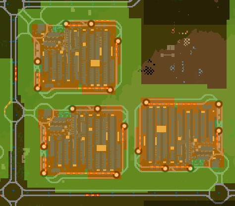
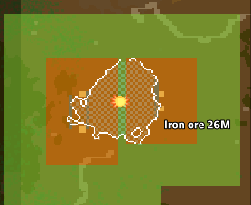
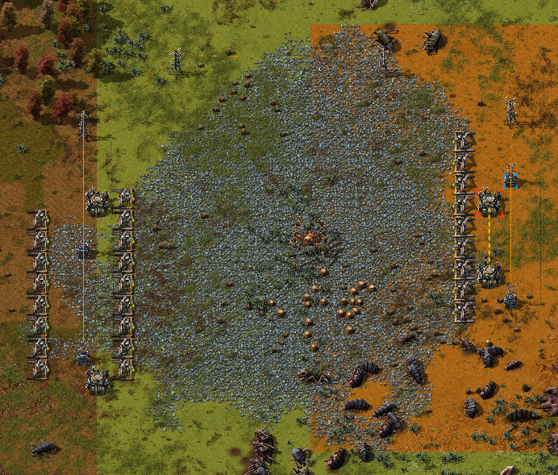
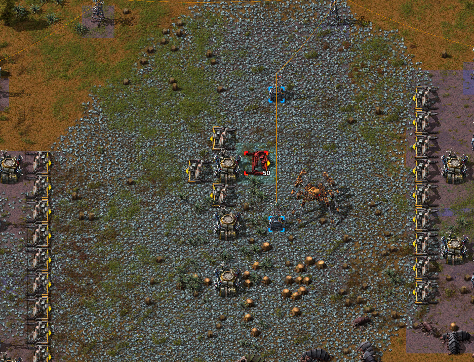
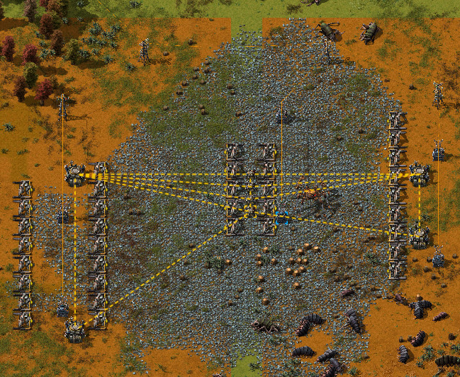
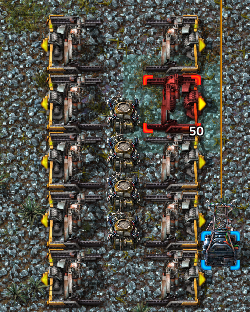
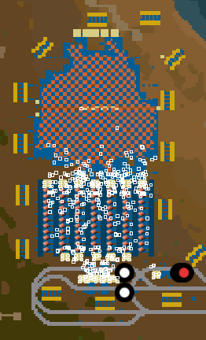
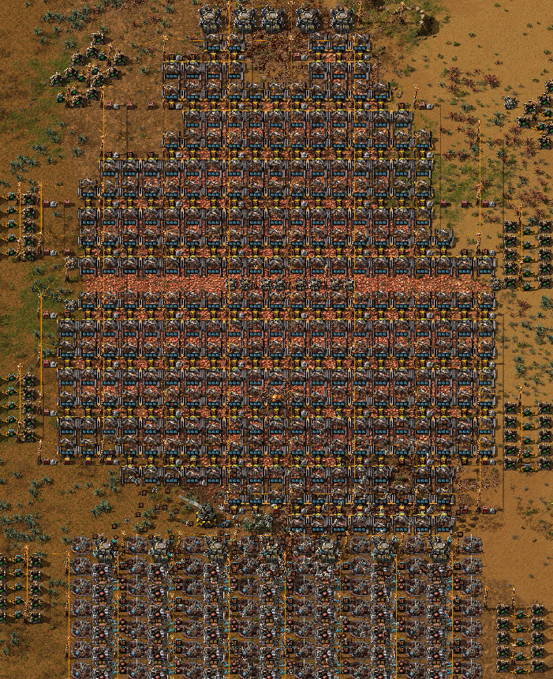

# Mini Roboports

A 1/4 sized Roboport with about 1/4 the coverage and half the charging ports.

The cost to make it is not a lot lower than the regular one for balancing purporses, because of the extra charging capacity and flexibility.

Why?

## Flexibility

To more flexibly separate close, but individual logistics networks. For example:

# Cover an entire ore patch

I like to cover an entire ore patch with miners and bots, so that I can just leave it there and
not worry about it until the patch is depleted. With regular roboports that can't be done
because of its 3x3 size.

If the patch is too big, roboports on its sides can't reach each other:

If you try to add roboports to connect in the center, even if you surround them with
miners, because of their 3x3 size there will always be a square out of the miners' reach:

Using mini roboports that's not a problem. You can put a line at the center to connect
both sides:

Thanks to the smaller size of mini roboports, miners won't have problems reaching every tile:

Here's an example of a mining base in a real game:

